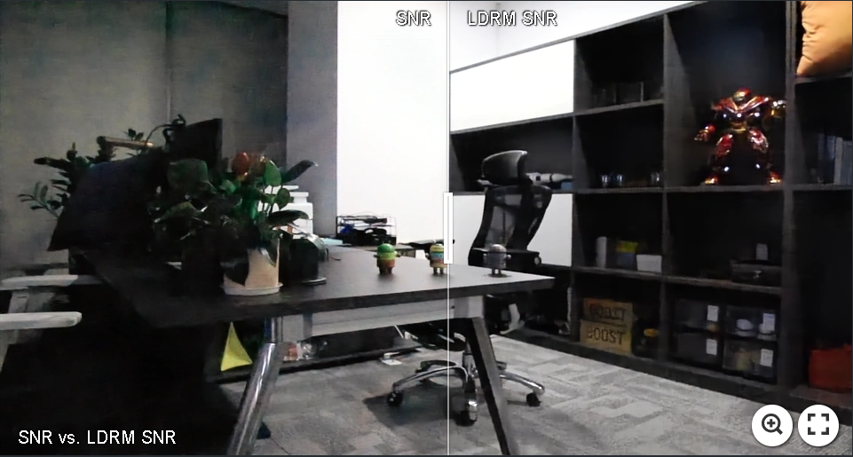
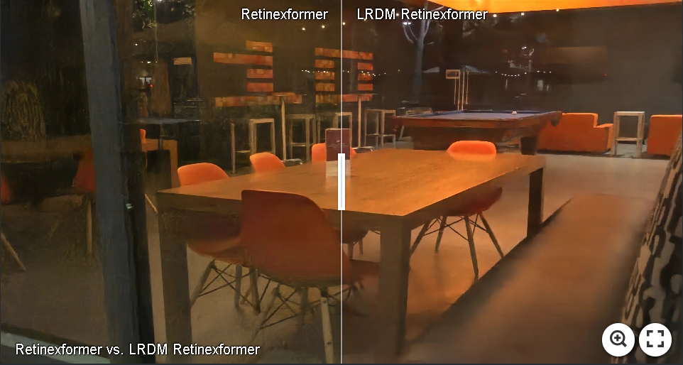
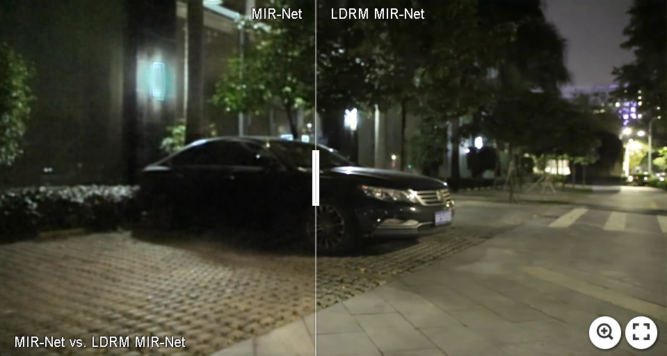
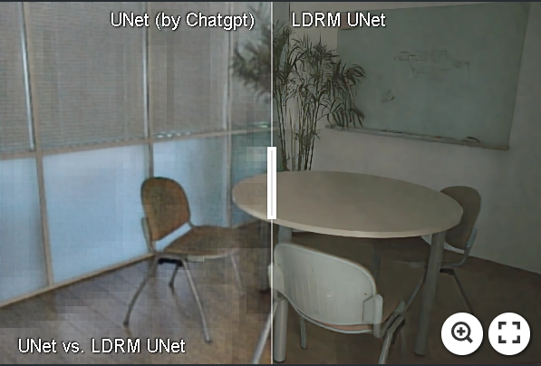

# Unveiling Advanced Frequency Disentanglement Paradigm for Low-Light Image Enhancement (ECCV 2024)

#### Kun Zhou, Xinyu Lin, Wenbo Li, Xiaogang Xu, Yuanhao Cai, Zhonghang Liu, Xiaoguang Han, Jiangbo Lu

<!-- #### [\[Paper\]](https://openaccess.thecvf.com/content/CVPR2023/papers/Zhou_NeRFLix_High-Quality_Neural_View_Synthesis_by_Learning_a_Degradation-Driven_Inter-Viewpoint_CVPR_2023_paper.pdf) [\[Project\]](https://t.co/uNiTd9ujCv)
--- -->

News, We have release the training and inference scripts for LoLv2 and our paper is available on [\[ARXIV\]](https://arxiv.org/pdf/2409.01641v1).

<!-- This is the official implementation of AFD-LLIE. Our paper will soon be available on ARXIV. Our code will be made available before ECCV24.  -->

Visual results, along with uploaded checkpoints, can be accessed at [\[google drive\]](https://drive.google.com/drive/folders/1cQprRn5LmazptHFcJcr_DTbykkDLnX8F?usp=sharing).

## We have explored ten SOTA LLIE baselines: 

CNN: UNet (written by Chatgpt), [\[MIR-Net ECCV 2020\]](https://github.com/swz30/MIRNet), 
[\[MIR-Net-V2 T-PAMI 2022\]](https://github.com/swz30/MIRNetv2)

 Transformer: [\[SNR CVPR 2022\]](https://github.com/dvlab-research/SNR-Aware-Low-Light-Enhance), [\[Retinexformer ICCV 2023 \]](https://github.com/caiyuanhao1998/Retinexformer), [\[Restormer CVPR 2020\]](https://github.com/swz30/Restormer)

  Mamba: [\[RetinexMamba\]](https://github.com/YhuoyuH/RetinexMamba), [\[MambaIR ECCV 2024\]](https://github.com/csguoh/MambaIR), 

 Diffusion-based: [\[Diff-L Siggraph 2023\]](https://github.com/JianghaiSCU/Diffusion-Low-Light) and Flow-based: [\[LLFlow AAAI 2022\]](https://github.com/wyf0912/LLFlow)).

Our proposed AFD-LLIE consistently and significantly enhances their performance. 

## Let's make UNet (by ChatGPT) great again! 
Even a basic UNet can achieve impressive results and outperform Retinexformer with 24.25dB on LOL-v2.

 ### Citation
If our work is useful for your research, please consider citing:

    @inproceedings{zhou2024,
    title={Unveiling Advanced Frequency Disentanglement Paradigm for Low-Light Image Enhancement},
    author={Kun Zhou, Xinyu Lin, Wenbo Li, Xiaogang Xu, Yuanhao Cai, Zhonghang Liu, Xiaoguang Han, and Jiangbo Lu},
    booktitle={Proceedings of the European Conference on Computer Vision},
    year={2024}
    }

---
